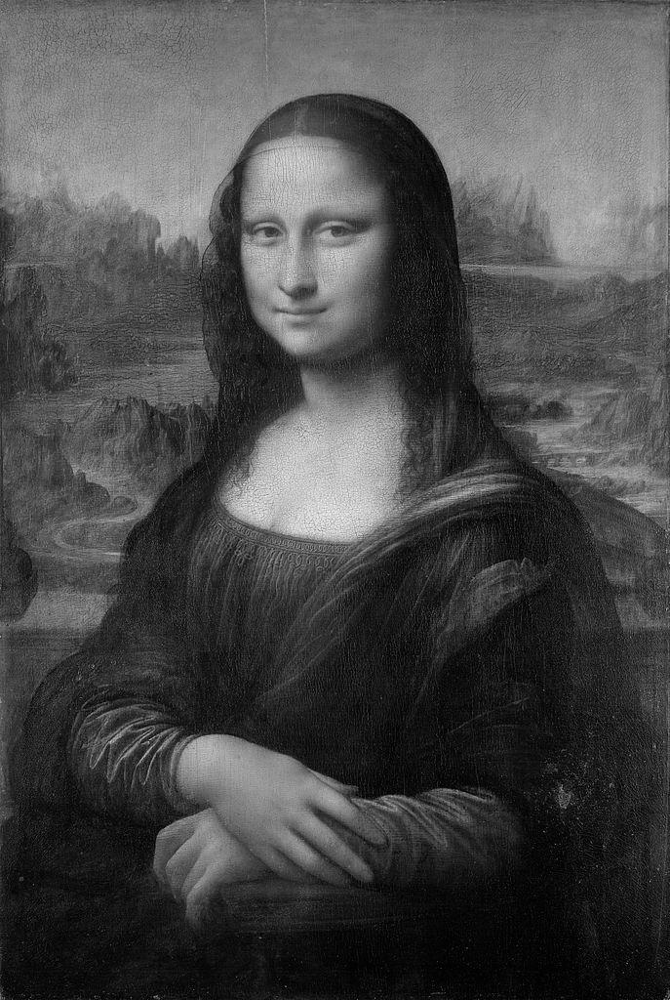
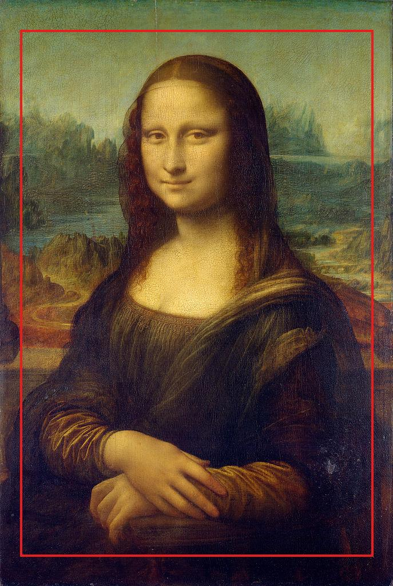
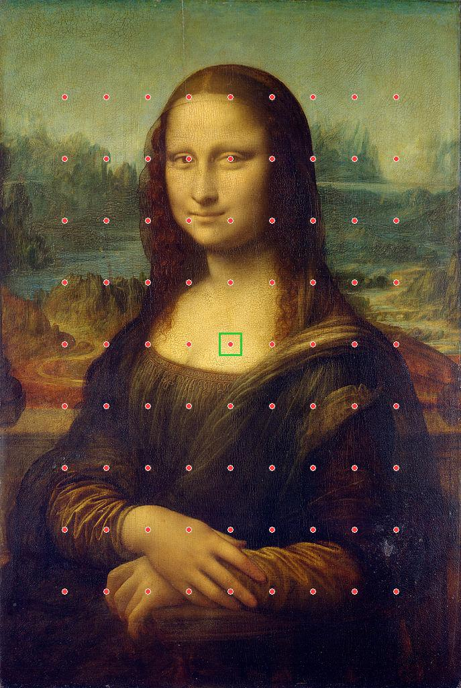
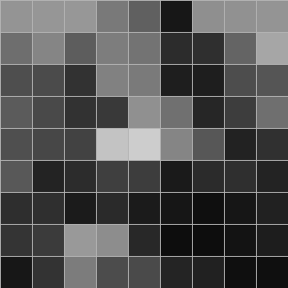
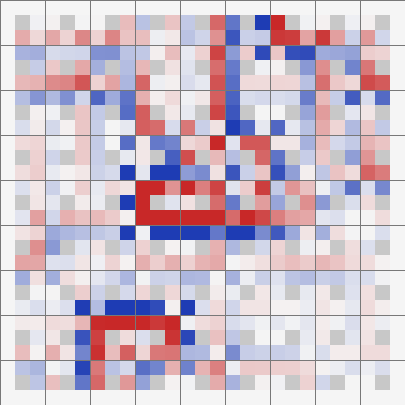
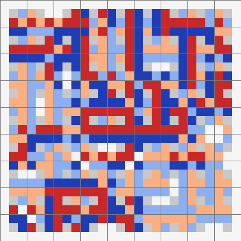
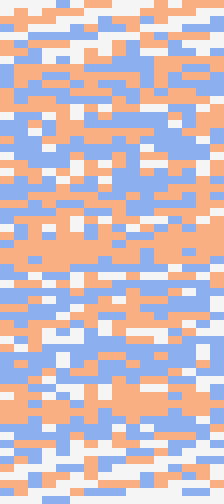

Image signatures and distances
==============================
Consider these two photographs of the `Mona Lisa`_:

.. image:: _images/MonaLisa_Wikipedia.jpg

(credit:
`Wikipedia <https://en.wikipedia.org/wiki/Mona_Lisa#/media/File:Mona_Lisa,_by_Leonardo_da_Vinci,_from_C2RMF_retouched.jpg>`__
Public domain)

.. image:: _images/MonaLisa_WikiImages.jpg

(credit:
`WikiImages <https://pixabay.com/en/mona-lisa-painting-art-oil-painting-67506/>`_
Public domain)

Though it's obvious to any human observer that this is the same image, we can
find a number of subtle differences: the dimensions, palette, lighting and so
on are different in each image. ``image_match`` will give us numerical
comparison:

.. code-block:: python

    from image_match.goldberg import ImageSignature
    gis = ImageSignature()
    a = gis.generate_signature('https://upload.wikimedia.org/wikipedia/commons/thumb/e/ec/Mona_Lisa,_by_Leonardo_da_Vinci,_from_C2RMF_retouched.jpg/687px-Mona_Lisa,_by_Leonardo_da_Vinci,_from_C2RMF_retouched.jpg')
    b = gis.generate_signature('https://pixabay.com/static/uploads/photo/2012/11/28/08/56/mona-lisa-67506_960_720.jpg')
    gis.normalized_distance(a, b)

Returns ``0.22095170140933634``. Normalized distances of less than ``0.40`` are
very likely matches. If we try this again against a dissimilar image, say,
Caravaggio's `Supper at Emmaus <https://en.wikipedia.org/wiki/Supper_at_Emmaus_(Caravaggio),_London>`_:

.. image:: _images/Caravaggio_Wikipedia.jpg

(credit: `Wikipedia <https://en.wikipedia.org/wiki/Caravaggio#/media/File:Caravaggio_-_Cena_in_Emmaus.jpg>`__ Public domain)

against one of the Mona Lisa photographs:

.. code-block:: python

    c = gis.generate_signature('https://upload.wikimedia.org/wikipedia/commons/e/e0/Caravaggio_-_Cena_in_Emmaus.jpg')
    gis.normalized_distance(a, c)

Returns ``0.68446275381507249``, almost certainly not a match. ``image_match``
doesn't have to generate a signature from a URL; a file-path or even an
in-memory bytestream will do (be sure to specify ``bytestream=True`` in the
latter case).

Now consider this subtly-modified version of the Mona Lisa:

.. image:: _images/MonaLisa_Remix_Flickr.jpg

(credit: `Michael Russell <https://www.flickr.com/photos/planetrussell/6814444991>`_ `Attribution-ShareAlike 2.0 Generic <https://creativecommons.org/licenses/by-sa/2.0/>`_)

How similar is it to our original Mona Lisa?

.. code-block:: python

    d = gis.generate_signature('https://c2.staticflickr.com/8/7158/6814444991_08d82de57e_z.jpg')
    gis.normalized_distance(a, d)

This gives us ``0.42557196987336648``. So markedly different than the two
original Mona Lisas, but considerably closer than the Caravaggio.

How a signature is computed
---------------------------

``generate_signature`` follows the Goldberg et al. paper. The intuition: a
signature does **not** describe what an image looks like — it describes, for a
coarse grid of points, whether the image gets *brighter or darker* in each of
the 8 directions around every point. That pattern survives resizing,
recompression, and modest colour changes, which is exactly what near-duplicate
detection needs. The figures below were generated from the actual pipeline on
the Mona Lisa above (``tools/make_signature_figures.py`` regenerates them).

Step 1 — decode and convert to greyscale
^^^^^^^^^^^^^^^^^^^^^^^^^^^^^^^^^^^^^^^^

Any input (path, URL, bytes, or numpy array) is decoded and reduced to a
single-channel float array in ``[0, 1]``. Our Mona Lisa is 687×1024 pixels.
Colour information is discarded at this point — which is why the signature is
insensitive to palette shifts.

Step 2 — crop featureless borders
^^^^^^^^^^^^^^^^^^^^^^^^^^^^^^^^^

``crop_image`` finds the rows/columns where most of the *change* happens and
drops uniform borders (5th–95th percentile of cumulative absolute difference).
For this image it keeps rows 52–972 and columns 35–652 — the frame and outer
edges are ignored, so a photo with a different frame or matte still matches.

Step 3 — place the 9×9 grid
^^^^^^^^^^^^^^^^^^^^^^^^^^^

``compute_grid_points`` places ``n × n`` = 81 evenly spaced sample points
inside the cropped region. The green box is one ``P × P`` window
(``P = 34`` px here — ``min(image dimension) / 20``) centred on a grid point.

Step 4 — mean grey level per window
^^^^^^^^^^^^^^^^^^^^^^^^^^^^^^^^^^^

``compute_mean_level`` averages each window into one number, giving a 9×9
matrix. Squint — the Mona Lisa is still recognizable: the dark mass of her
dress at the bottom, the light face/chest in the centre. This coarse grid is
the whole "content" the signature ever sees, which is why tiny watermark and
compression differences don't matter.

Step 5 — differences to the 8 neighbours
^^^^^^^^^^^^^^^^^^^^^^^^^^^^^^^^^^^^^^^^

``compute_differentials`` subtracts each grid point's level from each of its 8
neighbours, producing a 9×9×8 array. In the figure each 3×3 mini-block is one
grid point: the centre pixel is the point itself and the 8 coloured pixels are
the differences to its neighbours (blue = neighbour darker, red = neighbour
brighter, white = same).

Step 6 — quantize to the signature
^^^^^^^^^^^^^^^^^^^^^^^^^^^^^^^^^^

``normalize_and_threshold`` bins each difference into {-2, -1, 0, +1, +2}
(values within ``identical_tolerance`` of 0 collapse to 0). Flattened, that's
the signature: an int8 vector of 9·9·8 = **648 dimensions**. For this image the
bins are almost perfectly balanced: 128×(−2), 128×(−1), 136×(0), 128×(+1),
128×(+2).

Step 7 — split into words and encode as integers
^^^^^^^^^^^^^^^^^^^^^^^^^^^^^^^^^^^^^^^^^^^^^^^^

For *indexing* (not distance computation), the 648 values are split into
``N = 63`` overlapping words of ``k = 16`` values each, starting ~10 positions
apart (``linspace(0, 648, 63)``). ``max_contrast`` collapses each word to
{-1, 0, 1}, then ``words_to_int`` encodes it as a base-3 integer. Row 0 below::

    [0,0,0,0,-1,0,1,1,0,0,0,1,0,1,1,1]  →  simple_word_0 = 42429541

The record stored in the backend is ``{path, signature, metadata?,
simple_word_0 … simple_word_62}``.

From signature to index to match
--------------------------------

The word fields exist for one reason: a *cheap pre-filter*. An exact term
match on any ``simple_word_*`` makes a record a candidate, so the full
648-dim distance is only computed on a small subset — that is what lets the
index scale to billions of images.

.. mermaid::

    flowchart TB
        subgraph sig["1. Signature generation"]
            direction TB
            A["input image path · URL · array · bytes"] --> B["preprocess_image decode → greyscale float array"]
            B --> C["crop_image percentile bounds (5–95%) drop featureless borders"]
            C --> D["compute_grid_points n×n grid centres (9×9)"]
            D --> E["compute_mean_level mean grey per P×P window → n×n matrix"]
            E --> F["compute_differentials diffs vs. 8 neighbours → n×n×8"]
            F --> G["normalize_and_threshold bin to {-2 … +2}"]
            G --> H["signature int8 vector, 9·9·8 = 648 dims"]
        end

        subgraph idx["2. Indexing"]
            direction TB
            H --> I["get_words N = 63 overlapping words × k = 16"]
            I --> J["max_contrast collapse to {-1, 0, 1}"]
            J --> K["words_to_int each word → one integer"]
            K --> L["record: path · signature · metadata simple_word_0 … 62"]
            L --> M[("backend index")]
        end

        subgraph qry["3. Search"]
            direction TB
            Q["query image → same pipeline → record"] --> R["word query: match any simple_word_*"]
            M -.-> R
            R --> S["candidates: normalized_distance on full 648-dim signatures"]
            S --> T["keep dist &lt; distance_cutoff (0.45) dedupe → sort by dist"]
        end

With ``all_orientations=True`` the query is expanded to up to 8
rotations/mirrors/inversions of the same image.

The OpenSearch k-NN drivers skip the word pre-filter entirely — the 648-dim
``signature`` is stored as a ``knn_vector`` and searched directly with
approximate nearest neighbours. See :doc:`migration` for moving an existing
word index to a k-NN index.

.. _Mona Lisa: https://en.wikipedia.org/wiki/Mona_Lisa
